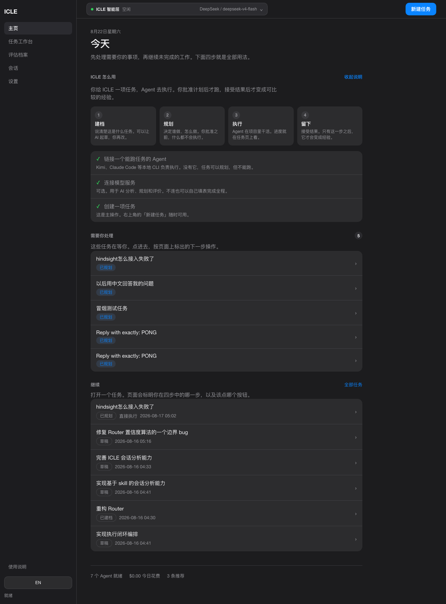
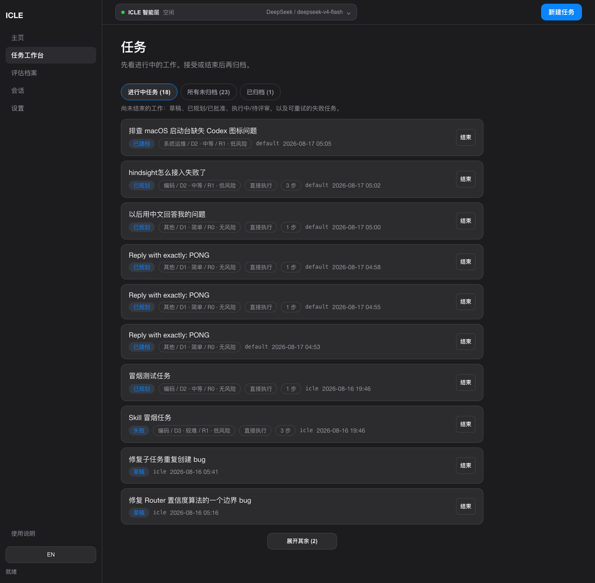
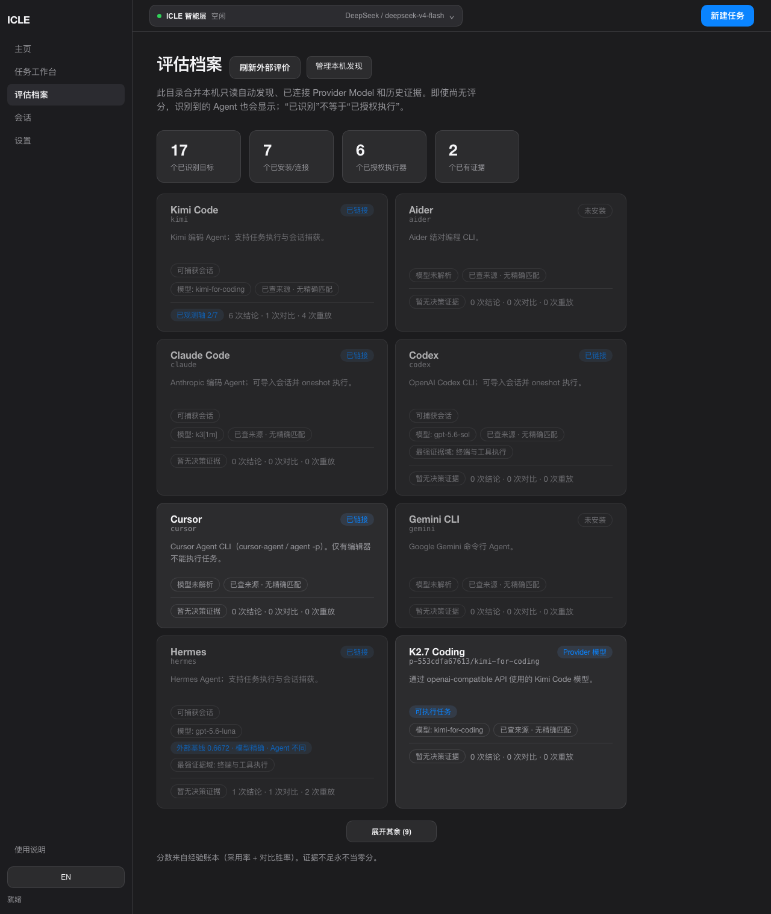
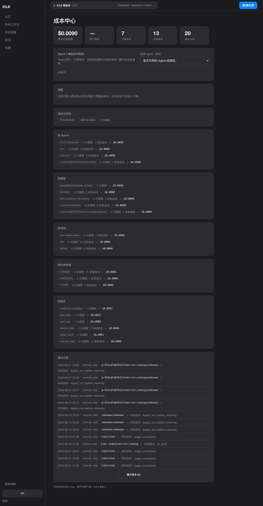

# AgentTogether

个人 Agent 工作台（代码名 `icle`）。运行、度量、决策：在你自己的任务上跑 Agent，记下谁做成了什么，按七轴算残差，再按你的政策决定下次用谁。

它不是公开 Benchmark 排行榜。缺失不是 0。未知成本不是 `$0`。

度量内核是冻结的 [`evaluation-engine-with-evolution`](https://github.com/Cyoung-Van/evaluation-engine-with-evolution)。

## 界面

本地控制面。任务从今天开始，档案看谁连上了，成本同时记现金和耗时。

**今天**



**任务工作台**



**评估档案**



**成本中心**



## 怎么工作

| 层 | 做什么 | 不做什么 |
|---|---|---|
| Runner | 任务从草稿到接受、Replay、协作、接 Provider / CLI | 不当度量器 |
| Measurement | 七轴 \(C = J - A - B\) | 不出总分、不做排名 |
| Decision | `icle-decision-loss/v0.1` 给 Router / 推荐排序 | 不回流度量层 |

智能层（规划、画像、摘要）可关。关掉也能手工建任务、执行、记账。

任务成本是本地账本：官方 usage，或 agent 在固定表里填写的 token 和耗时，再乘价表。价表顺序是你的覆盖 → [models.dev](https://models.dev) → LiteLLM → 内置快照。对不上的模型保持未定价。墙钟时间记在同一条记录里。

细节见 [`docs/ARCHITECTURE.md`](docs/ARCHITECTURE.md) 和 [`DECISIONS.md`](DECISIONS.md)。

## 运行

支持 macOS / Linux（Python 3.11、Node 22.12+）。锁实现依赖 `fcntl`，Windows 请使用 WSL，暂不支持原生 Windows。默认只绑环回；非 `127.0.0.1` 必须设置 `ICLE_TOKEN`。

```bash
python3.11 -m venv .venv
source .venv/bin/activate
pip install --require-hashes -r requirements.lock
cd web && npm ci && npm run build && cd ..

PYTHONPATH=src python -m icle serve \
  --store ./experience-store \
  --capture-store ./capture-store
```

打开 http://127.0.0.1:8000 。在 Settings 里加 Provider，并刷新价格目录。

```bash
PYTHONPATH=src python -m unittest discover -s tests -q
```

`experience-store/` 和 `capture-store/` 含本地证据与密钥引用，已忽略，不要提交。

## 执行与证据边界

执行使用**当前工作树的过滤副本**，包括未提交修改和未跟踪文件，不复制 Git 历史。默认排除 `.env`、`.env.*`、私钥、密钥目录、依赖目录和符号链接；项目根目录 `.icleignore` 可按行增加 glob 排除规则。运行页显示提交号、脏状态和排除清单。目录副本不限制 CLI Agent 的系统权限，不是安全沙箱。

API 步骤通过提示获得文件正文；每步完整输出独立保存。文本上下文超过 40 个文件或 256,000 字节、含无法读取的二进制/非 UTF-8 文件时，API 执行明确失败，需缩小输入范围或使用本地 CLI。`CLEAN` 不传文件；`ARTIFACT_ONLY` 仅传初始化后变化的文件，`PROJECT_STATE` 传过滤后的项目文件。

新运行保存实际执行顺序与最终步骤，旧运行只能按时间戳推断顺序。新账本使用 `hash_version: 2` 覆盖完整记录；旧账本仍按原规则验证，**旧记录的 Agent / Episode 归属不因此获得完整性保证**。详见 [可靠性修复说明](docs/RELIABILITY.md)。

## 仓库里有什么

| 路径 | 说明 |
|---|---|
| `src/icle/` | Runner、度量适配、决策、成本、API |
| `web/` | 控制面。生产构建输出到 `web/dist`，由服务托管 |
| `tests/` | unittest |
| `skills/` | 可选智能层 skill |
| `vendor/evaluation-engine-with-evolution/` | 冻结的度量内核和离线数据 |
| `docs/` | 现行架构与协同合同 |
| `DECISIONS.md` | 关键决定 |

## 许可

AgentTogether（`icle`）源码与文档为 [MIT](LICENSE)。

本仓库还带了第三方组件，许可不因 MIT 而改变：

- `vendor/evaluation-engine-with-evolution/` 的代码是 Apache-2.0；其 `data/` **不重新授权**，见该目录 [`NOTICE`](vendor/evaluation-engine-with-evolution/NOTICE)
- 社区价表来自 models.dev（MIT）和 LiteLLM；发票以厂商官方页为准
