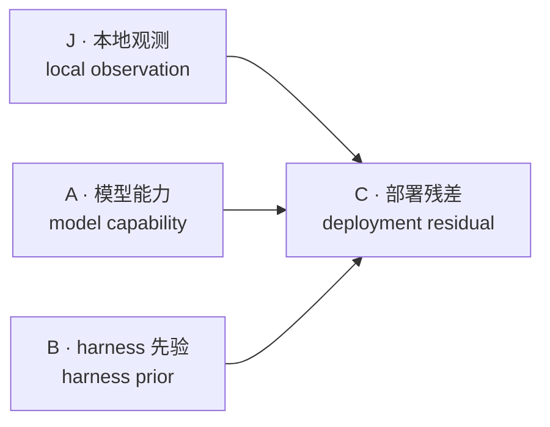
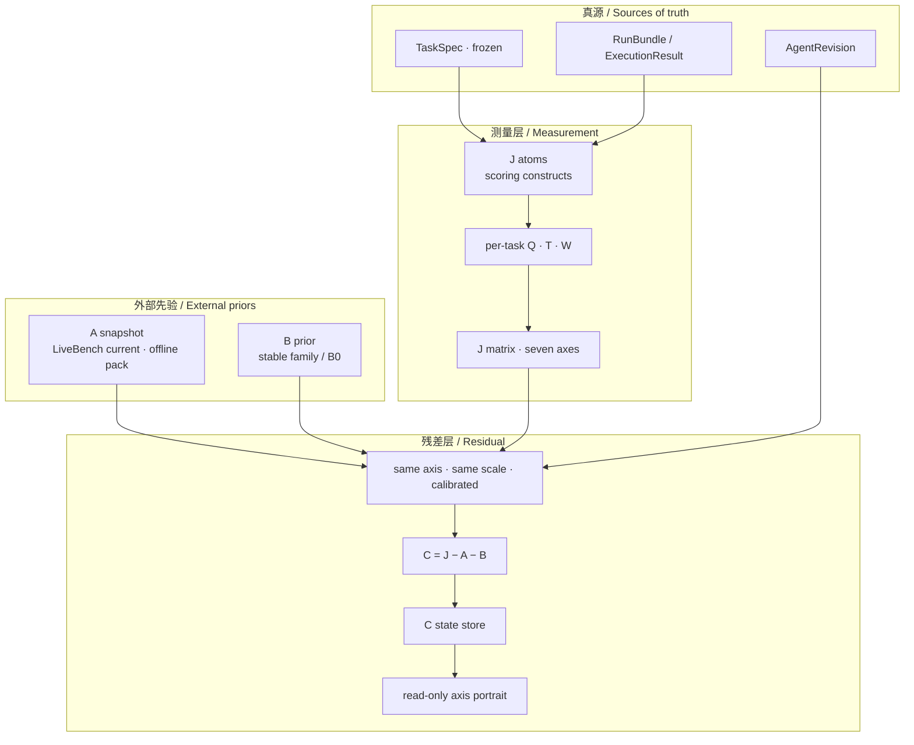
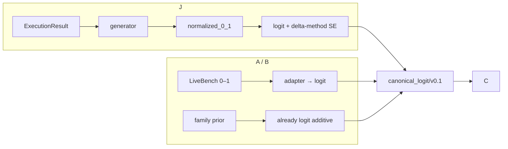
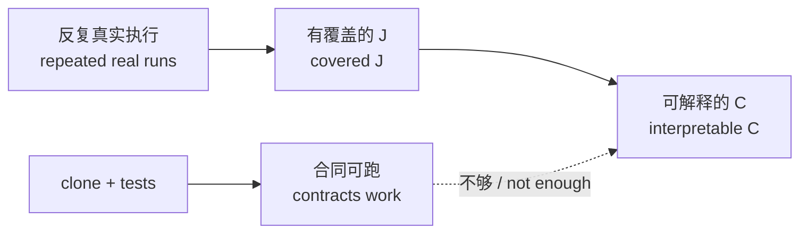

# evaluation engine with evolution

用 **A + B + C** 测量 Agent 的部署残差，为多 Agent 协同调度提供分轴信号。不做总分，也不做排名。  
Measure an agent as **A + B + C** and serve per-axis signals to multi-agent orchestration. No total score. No ranking.

公开仓库 / Public repo: https://github.com/Cyoung-Van/evaluation-engine-with-evolution

---

## 定位 / Positioning

这是一个**度量引擎**，最终服务于多 Agent 协同调度。不是排行榜，也不是 Agent 执行器。  
This is a **measurement engine** meant to serve multi-agent orchestration. It is not a leaderboard and not an agent runner.

调度需要的是「这个子任务该派谁」，那是逐轴比较。一旦压成总分，路由就退化成「永远派最强的那个」，协同也就失去意义——所以**不出总分不是洁癖，是引擎的分辨率要求**。  
Orchestration asks "who should take this subtask", which is a per-axis comparison. Collapsing it into a total degrades routing into "always dispatch the strongest", which defeats collaboration. **Refusing a total score is a resolution requirement, not fastidiousness.**

度量层输出每轴后验（`mean` + `variance`）；标量化只发生在决策层，带显式的、有版本的损失函数，并且**不回流**到度量层。  
The measurement layer emits a per-axis posterior (`mean` + `variance`). Scalarization happens only in the decision layer, under an explicit versioned loss, and never flows back.

## 这是什么 / What this is

它回答的问题是：

> 在固定模型、固定 harness、固定任务合同上，这个 Agent 相对「模型能力 + harness 先验」还多出（或少了）什么？

It asks:

> Given a frozen model, a frozen harness, and a frozen task contract, what residual does this agent still show after subtracting model capability and harness prior?

估计对象是七个能力轴上的潜在状态，不是一个百分数。  
The estimand is a seven-axis latent state, not a single percentage.



\[
C_{g,k} = J_{g,k} - A_{m,k} - B_{h,k}
\]

- **A**：底座模型在公开基准上的能力。来自冻结的 LiveBench current 七轴。  
  Base-model capability from frozen LiveBench current, one axis per LiveBench category.
- **B**：harness / agent 家族的弱加性先验。文档级、可收缩，不是精确对照实验。  
  A weak additive prior for the harness / agent family. Document-level, shrinkable, not an exact matched experiment.
- **J**：这个主体在本地冻结 TaskSpec 上的观测评估矩阵。量尺是 `canonical_logit/v0.1`。  
  The observed evaluation matrix on local frozen TaskSpecs, on `canonical_logit/v0.1`.
- **C**：残差。每个主体一份七轴画像。**C 不是「经验带来的因果增益」**，只是当前部署相对 A+B 的偏差。  
  The residual portrait. **C is not a causal claim about experience.** It is the current deployment deviation from A + B.

数学 / 数据 / 语言主要跟模型走。Agent 差异优先看 `coding` 和 `agentic_coding`。  
Mathematics, data analysis, and language mostly follow the model. Agent differences should show first on `coding` and `agentic_coding`.

多 Agent 协同用一套**独立轴族**，锚点不同：七轴锚公开基准，协同轴锚**成员单干**。设计见 [多 Agent 协同度量](docs/MULTI_AGENT_COORDINATION_MEASUREMENT.md)，目前是设计稿，未实现。  
Multi-agent coordination uses a **separate axis family** with a different anchor: the seven axes anchor a public benchmark, coordination axes anchor **members working solo**. See [multi-agent coordination measurement](docs/MULTI_AGENT_COORDINATION_MEASUREMENT.md). It is a design draft, not implemented.

\[
C^{coord}_{k} = J^{team}_{k} - \max_{i} A^{solo}_{i,k} - B^{orch}_{k}
\]

---

## 架构思路 / Architecture

真源是运行事实。评价是可重算的派生物。派生矩阵不能覆盖原始运行。  
Runs are the source of truth. Evaluations are versioned derivatives. A derived matrix never overwrites a run.



### 为什么拆成 A / B / J / C

Why split A / B / J / C

| 层 Layer | 回答的问题 Question | 不能拿它当什么 Not a substitute for |
|---|---|---|
| **A** | 这个底座模型本身有多强？ How strong is the base model? | 这个 Agent 在你任务上的表现 How the agent does on *your* tasks |
| **B** | 这类 harness 通常加多少？ What additive effect does this harness family usually add? | 精确的 harness 对照实验 An exact harness A/B test |
| **J** | 这个主体在这批冻结任务上实际测到了什么？ What did we observe on these frozen tasks? | 公开榜上的绝对能力 A public-benchmark absolute score |
| **C** | 扣掉模型和 harness 后还剩什么？ What remains after subtracting A and B? | 因果「进化量」或总分 A causal evolution score or a total |

v0 不估计模型–harness 交互，默认 \(I_{m,h}=0\)。  
v0 does not estimate a model–harness interaction. \(I_{m,h}=0\) by default.

### 身份、量尺、门禁

Identity, scale, and gates

1. **身份必须可解析。** 模型按精确 config 匹配；harness 按稳定家族或通用默认匹配。不做模糊字符串猜测。  
   Identities must resolve. Models match on exact dataset configs; harnesses match a stable family or the generic default. No fuzzy string matching.
2. **量尺必须同一合同。** J 是源矩阵。A/B 经版本化 adapter 进入 `canonical_logit/v0.1`。C 只消费已对齐的字段，不再各自换轴。  
   One scale contract. J owns the source matrix. A and B enter `canonical_logit/v0.1` through versioned adapters. C consumes aligned fields only.
3. **缺失不是 0。** 任一扇门失败，C 输出 `unavailable` 和原因，不把缺测的 A/B 当成零，也不截断负残差。  
   Missing is not zero. If a gate fails, C is `unavailable` with reasons. Absent A/B is never treated as 0. Negative residuals are kept.



### J 原子：评分构念，不是考题

J atoms are scoring constructs, not exam items

J 侧原子接到 LiveBench 的 23 个 current 子任务，映射冻结为 `T`；轴权重 `W` 由 `T` 按轴取 max，**不对 T 做行归一化**。  
J atoms link to LiveBench’s 23 current subtasks through a frozen map `T`. Axis weights are \(W_{c,k}=\max_{s:G_{s,k}=1}T_{c,s}\). Do **not** row-normalize `T`.

每个任务只用**自己的**语义掩码 `Q` 投影。不把整批任务的原子先池化再套一个并集 Q——那样会让 off-axis 原子漏进其他轴。  
Each task is projected with **that task’s** semantic mask `Q`. Do not pool every subject atom and then apply a union Q. That leaks off-axis atoms into other axes.

未映射原子（`tool_invocation`、`memory_retrieval`、`context_seeking`）不进 `T`，也不进 C。  
Unlinked atoms (`tool_invocation`, `memory_retrieval`, `context_seeking`) never enter `T` or C.

覆盖只统计「该任务 `Q_k>0` 且原子已观测」的贡献。缺失跳过，不当 0。若打开原子投影后没有任何已映射原子，J 单元格保持 `value=None` / `insufficient_coverage`，不退回 capability-loadings 的公开值。  
Coverage counts an atom only on tasks that contribute and have `Q_k>0`. Missing atoms are skipped, never filled with 0. If the overlay is on and no mapped atom is observed, the J cell stays `value=None` / `insufficient_coverage`. It does not fall back to a capability-loadings public value.

---

## 七轴 / Seven axes

合同 / contract: `livebench-capability-seven/v0.1`

| 轴 Axis | 主要跟谁走 Follows | LiveBench 类目 Category |
|---|---|---|
| `reasoning` | 模型 model | Reasoning |
| `coding` | Agent 差异优先 agent first | Coding |
| `agentic_coding` | Agent 差异优先 agent first | Agentic Coding |
| `mathematics` | 模型 model | Mathematics |
| `data_analysis` | 模型 model | Data Analysis |
| `language` | 模型 model | Language |
| `instruction_following` | 模型 / 任务合同 model / task contract | IF |

七轴始终列出。未观测轴保持 `unavailable`，不填 0，不平均成总分。  
All seven axes are always listed. Unobserved axes stay `unavailable`. They are not filled with 0 and not averaged into a total.

---

## 现在能跑什么 / What runs today

实现的是无 LLM 的矩阵生成器、原子 → 七轴 J、A/B 注册查询、J→C、C 状态、只读分轴画像。

**不实现** Agent 执行器、任务调度、LLM Judge、或画像 UI。外部 runner 导出 `RunBundle` 后，本仓库只负责入库、测量和残差。

Implemented today: an LLM-free matrix generator, atom → seven-axis J, A/B registry lookup, J→C, C state, and a read-only axis portrait.

**Not implemented:** an agent executor, a task scheduler, an LLM judge, or a portrait UI. An external runner exports `RunBundle`s; this repo only ingests, measures, and subtracts.

```bash
# 合同测试 / contract tests
PYTHONPATH=src python3 -m unittest discover -s tests -p 'test_*.py' -q

# 原子运行时（本地受控，不是公开能力证明）
# atom runtime — local-controlled, not a public capability claim
PYTHONPATH=src python3 scripts/run_atom_runtime.py --output data/generated/atom-demo

# 本地真实路径夹具 / local usage fixture path
PYTHONPATH=src python3 scripts/run_local_usage.py \
  --output data/generated/local-usage-demo \
  --store data/generated/local-usage-c-state \
  --profile data/generated/local-usage-demo/portraits.json \
  --observed-at 2026-08-20T12:00:00+00:00
```

两个脚本都拒绝覆盖已存在的输出目录，输出写到被 gitignore 的 `data/generated/`。  
Both scripts refuse to overwrite an existing output directory and write into the gitignored `data/generated/`.

公开 LiveBench A **不能**直接当成「这个本地 Agent 的绝对能力」。同 TaskSpec 上的 `baseline_model` 探针，才是本地对比路径。  
Public LiveBench A is **not** this local agent’s absolute ability. A `baseline_model` probe on the **same** TaskSpecs is the local comparison path.

模拟数据只用于合同验证，不证明真实能力。  
Simulated data validates contracts. It does not prove real-world capability.

---

## 已知不足 / Known limitations

这些是当前实现的真实限制，不是文档修辞。后续会改。  
These are real limits of the current implementation, not documentation hedging. They will be improved.

### 1. A 是离线打包的数据集，会过时

A is an offline packed dataset and can go stale

当前 A 来自随仓库分发的版本化快照（`data/matrices/<as-of>/`），不是每次运行去拉 LiveBench 最新分。  
A is a versioned snapshot shipped with the repo (`data/matrices/<as-of>/`). The runtime does **not** fetch the latest LiveBench scores on every run.

好处是可复现、可哈希校验、不依赖外网。风险是：模型改版、LiveBench 题目轮换、或 current 目录更新后，本地包会落后。Freshness policy 把 A 的窗口标成 120 天，但**过期不会自动更新数据包**。  
The upside is reproducibility and SHA-256 verification without a network call. The risk is drift: model revisions, LiveBench item rotation, or catalog updates can leave the local pack behind. The freshness policy marks a 120-day window for A, but **staleness does not refresh the pack**.

**后续：** 把 A 的刷新做成可审计的更新流水线（拉 current → 重校准 → 新 `as-of` 快照 → 哈希进 manifest），运行时仍只读冻结包，不在推断时访问外网。  
**Next:** an auditable A refresh pipeline (pull current → recalibrate → new `as-of` snapshot → hash into the manifest). The runtime will still read a frozen pack and will not hit the network during inference.

### 2. 稳定估值需要实际跑任务，不是立竿见影

Stable C needs real task runs. It is not instant.

克隆仓库、跑通测试、甚至跑一遍 `run_atom_runtime.py`，**都不会**得到可发布的真实 Agent 画像。那些路径验证的是合同和投影，用的是夹具或模拟。  
Cloning the repo, passing tests, or running `run_atom_runtime.py` does **not** produce a publishable real-agent portrait. Those paths check contracts and projections with fixtures or simulation.

要形成稳定 C，必须：

1. 冻结一批 TaskSpec；
2. 用外部 runner 在真实 AgentRevision 上反复执行；
3. 入库 `RunBundle` → `ExecutionResult`；
4. 最好同时跑同模型的 `baseline_model` 探针，作为本地 A；
5. 让 C 状态在时间窗里累积，而不是看单次残差。

To get a stable C you must:

1. freeze a TaskSpec set;
2. run a real AgentRevision repeatedly through an external runner;
3. ingest `RunBundle` → `ExecutionResult`;
4. preferably run a same-model `baseline_model` probe as local A;
5. let C state accumulate over a time window — do not treat a single residual as the portrait.

单次运行噪声大。轴覆盖不足时单元格会是 `unavailable` / `insufficient_coverage`，这是正确行为，不是故障。  
A single run is noisy. Thin axis coverage correctly yields `unavailable` / `insufficient_coverage`. That is not a bug.



### 3. 公开 A 与本地 J 没有 common-item 链接

Public A and local J are not common-item linked

把公开 LiveBench A 直接减进本地 J，绝对 C 会受任务难度压缩（模拟里大约 1.16 logit）。没有共同题目链接时，**看同模型对比和排序，不看绝对值**。  
Subtracting public LiveBench A from local J biases absolute C (about 1.16 logit of compression in simulation). Without common-item linking, **use same-model contrasts and ranks, not absolute C**.

同 TaskSpec 的本地探针 A 是当前唯一的 common-item 路径；它只对这一批任务成立，不写回公开 A 快照。  
A local probe A on the same TaskSpecs is the only current common-item path. It holds for that batch only and is not written back into the public A snapshot.

### 4. B 是弱先验，不是测出来的 harness 效应

B is a weak prior, not a measured harness effect

运行时 B 来自稳定家族文档先验或通用 \(B_0\)，可按家族观测收缩。它不是精确 harness 对照，也不是 release 版本级矩阵。  
Runtime B is a stable-family document prior or generic \(B_0\), optionally shrunk by family observations. It is not an exact harness contrast and not a release-version matrix.

### 5. 本仓库不跑 Agent

This repo does not run agents

没有执行器，就没有新的真实 J。估值速度取决于你自己的 runner 和任务量，不取决于克隆速度。  
Without an executor there is no new real J. Estimate speed depends on your runner and task volume, not on how fast the repo clones.

### 6. 部分运行时门禁仍偏粗

Some runtime gates are still coarse

C 对 `synthetic_only` / `publishable` 有特判，`local_controlled` 与 `shadow` 还不是一等公民的可用性类。身份解析按先命中绑定，catalog-only 不会加载 A。这些会在后续合同里收紧，不在 README 里假装已经完成。  
C special-cases `synthetic_only` vs `publishable`; `local_controlled` and `shadow` are not first-class availability classes yet. Identity binding is first-match; catalog-only never loads A. These will be tightened in later contracts. This README does not pretend they are done.

### 7. 协同度量只有设计，没有实现

Coordination measurement is designed, not built

引擎定位要求测「放在一起多出什么」，但现在只有单体度量。缺三块：团队作为一等主体（`TeamRevision`）、`role=solo_baseline` 锚点、协同轴族。成员对效应 \(\mathbf P_{i,j}\) 与单体的 \(\mathbf I_{m,h}\) 一样仍被置零，所以协同 C 是**拓扑与成员组合的联合残差**，不是协同机制的因果效应。  
The engine role requires measuring what a team adds, but only single-agent measurement exists. Three pieces are missing: the team as a first-class subject (`TeamRevision`), the `role=solo_baseline` anchor, and the coordination axis family. Pair effects \(\mathbf P_{i,j}\) are zeroed like \(\mathbf I_{m,h}\), so coordination C is a **joint residual over topology and membership**, not a causal effect of coordination.

三个协同相关的原子（`tool_invocation`、`memory_retrieval`、`context_seeking`）目前被隔离在映射之外，因为它们接不上 LiveBench。协同轴族换成 solo 锚点后它们才能重新入场。  
The three coordination-relevant atoms (`tool_invocation`, `memory_retrieval`, `context_seeking`) are currently quarantined because they link to no LiveBench subtask. They re-enter only under the coordination family's solo anchor.

### 8. 大部分测试仍是夹具，不是真实数据

Most tests are fixtures, not shipped data

119 个测试在不到一秒内跑完，因为它们绝大多数用内联夹具和临时目录。随仓库分发的 A/B 快照只被少量测试语义性地读取，重建脚本的 8.8 万行输出没有断言。  
The 119 tests finish in under a second because nearly all of them use inline fixtures and temporary directories. Only a few tests read the shipped A/B snapshot semantically, and the 88k-row rebuild output has no assertions on it.

### 已修的（记录，避免重复报告） / Already fixed

- A 的观测回退曾只映射 Reasoning/Coding 两轴，现在与校准合同共用同一份 LiveBench 类目映射，且合同不能自造或改写类目。  
  The A observation fallback once mapped only two categories; it now shares one LiveBench category map with the calibration contract, which can restrict but not invent categories.
- 稳定家族 B 先验不完整曾直接 `KeyError`，现在按轴回退到通用先验并报出 `incomplete_family_prior_dimension`。  
  An incomplete stable family B prior used to raise `KeyError`; it now falls back per axis and reports `incomplete_family_prior_dimension`.
- 同轴冲突的家族观测曾按迭代顺序静默取最后一条，现在整条丢弃并报出原因。  
  Conflicting family observations on one axis used to be resolved silently by iteration order; they are now dropped with a reason.
- `atom_projection.default_stderr` 曾是被校验但从不使用的死配置，现在显式拒绝：原子标准误只来自跨任务变异。  
  `atom_projection.default_stderr` was validated but never used; it is now rejected outright. Atom stderr comes from across-task variation only.
- C 状态的时间衰减曾无条件拉向 0，现在回归配置的先验均值。  
  C-state decay used to pull toward a hard 0; it now reverts to the configured prior mean.
- 159MB 重建专用 dump 不再随仓库分发，摘要留在 manifest 的 `audit_artifacts` 里；clone 从 219MB 降到 37MB。  
  159MB of rebuild-only dumps no longer ship with the repo; their digests stay in the manifests under `audit_artifacts`. A clone went from 219MB to 37MB.

---

## 纪律 / Discipline

- 不产生总分，不平均成百分制。 No total. No percentage average.
- `unknown` / `not_observed` 与数值零严格区分。 `unknown` / `not_observed` are not numeric zero.
- 缺失不当 0。 Missing is skipped, never imputed as 0.
- 模拟只验证合同。 Simulation validates contracts only.
- 绝对 C 在未链接时不可当能力值。 Unlinked absolute C is not a capability claim.
- 运行不可变，评价可按新版本重算。 Runs are immutable; evaluations may be recomputed under a new revision.

---

## 规格 / Specifications

核心 / Core

1. [基础数学 / Mathematical foundation](docs/01_MATHEMATICAL_FOUNDATION.md)
2. [端到端流程 / End-to-end flow](docs/02_END_TO_END_FLOW.md)
3. [矩阵规格 / Matrix specification](docs/03_MATRIX_SPECIFICATION.md)
4. [七轴与量尺合同 / Axis and scale contract](docs/DATA_UPDATE_AND_CANONICAL_CONTRACT.md)
5. [A/B/J/C 流水线 / A/B/J/C pipeline](docs/BUILTIN_ABJC_PIPELINE.md)
6. [本地使用与画像 / Local usage and portrait](docs/LOCAL_USAGE_AND_PROFILE.md)
7. [多 Agent 协同度量 / Multi-agent coordination measurement](docs/MULTI_AGENT_COORDINATION_MEASUREMENT.md)（设计稿 / draft）

组件 / Components

8. [J 生成器 / Evaluation matrix generator](docs/EVALUATION_MATRIX_GENERATOR.md)
9. [C 状态更新 / C state updater](docs/C_STATE_UPDATER.md)
10. [B 默认先验 / Default B prior](docs/B_DEFAULT_PRIOR.md)
11. [B 稳定家族特化 / Stable agent specializations](docs/B_STABLE_AGENT_SPECIALIZATIONS.md)
12. [B Exact anchor 计划 / Exact anchor plan](docs/B_EXACT_ANCHOR_PLAN.md)

数据 / Data

13. [Freshness policy](docs/FRESHNESS_POLICY.md)
14. [数据目录说明 / Data directory](data/README.md)
15. [公开数据集快照 / Public dataset snapshot](docs/PUBLIC_DATASET_2026-08-19.md)
16. [A/B 数据集构建 / A/B dataset build](docs/AB_DATASETS_2026-08-19.md)
17. [样本与模拟数据集 / Sample and simulation datasets](docs/SAMPLE_AND_SIMULATION_DATASET_2026-08-19.md)
18. [参考项目与复用边界 / References and reuse boundaries](docs/REFERENCES.md)

## 许可 / License

代码、schema、config 和文档使用 [Apache-2.0](LICENSE)。  
Code, schemas, configs, and docs are [Apache-2.0](LICENSE).

`data/` 下重分发的上游评测数据**不被本许可重新授权**，各自保留原始许可与条款，记录在 `data/raw/<as-of>/source_registry.json`。详见 [NOTICE](NOTICE)。  
Upstream evaluation data redistributed under `data/` is **not** relicensed. Each source keeps its own terms, recorded in `data/raw/<as-of>/source_registry.json`. See [NOTICE](NOTICE).
