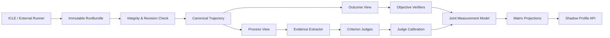

# 端到端评估流程 v0.1

## 1. 总体流程



核心原则：运行事实不可变；评价可以按新版本重算；任何派生矩阵都不能覆盖原始运行。

## 2. 真源与派生层

### 真源

- `TaskSpec`
- `AgentRevision`
- `RunBundle`
- Raw trajectory events
- Artifact manifest
- Objective verifier facts
- Human annotations

### 版本化派生物

- Canonical trajectory
- Evidence units
- Rubric ratings
- Judge calibration parameters
- Capability posterior
- Matrix projections

评价版本升级时创建新的 `MeasurementRevision`，不改写旧评价。

## 3. 阶段 0：注册 TaskSpec

执行前创建不可变 TaskSpec：

- task identity 与内容 hash；
- domain / task family；
- task input 与允许上下文；
- expected artifacts；
- Objective verifier；
- semantic Q；
- rubric criteria；
- rubric–capability mapping M；
- risk、timeout 和环境约束；
- template/version/source/license。

TaskSpec 状态：

```text
draft → reviewed → frozen
```

只有 `frozen` TaskSpec 可以进入正式评估。

## 4. 阶段 1：注册 AgentRevision

记录：

- model/provider/revision；
- harness/version；
- prompt/persona hash；
- memory policy 与 snapshot hash；
- tools/skills/plugins/MCP hash；
- environment/runtime image；
- execution policy 与 resource limit。

私密内容可以只保存受控 hash 和审计引用，不把 Secret 写进 RunBundle。

## 5. 阶段 2：接收 RunBundle

RunBundle 至少包含：

- `run_id`、`task_spec_id`、`agent_revision_id`；
- start/end time；
- raw events；
- stdout/stderr；
- tool calls 与 observations；
- artifacts、diff、checksums；
- resource/cost/latency facts；
- environment delta；
- truncation/redaction/missingness；
- runner revision 与 signature。

接收过程必须幂等：同一个 `run_id + content_hash` 重复提交返回同一结果；相同 `run_id` 不同 hash 进入冲突状态。

## 6. 阶段 3：完整性和安全检查

检查：

- Schema 和 hash；
- TaskSpec 与 AgentRevision 是否存在；
- 时间顺序、parent/span 关系；
- Artifact 是否可读取；
- 路径穿越、超大内容和非法引用；
- redaction 是否完整；
- 轨迹中是否存在针对 Judge 的 Prompt Injection；
- 是否发生结果或 Agent 身份泄漏。

失败状态：

```text
invalid_schema
hash_mismatch
missing_revision
unsafe_payload
identity_leak
outcome_leak
```

无效 RunBundle 可以保留审计记录，但不进入测量模型。

## 7. 阶段 4：Canonical Trajectory

适配器把不同 Agent 的运行转成共同事件类型：

```text
message
action
tool_call
tool_result
artifact_change
verification
error
retry
checkpoint
final_output
```

每个事件包含：

- event/span/parent ID；
- timestamp/order；
- source adapter；
- visibility；
- payload hash；
- redaction/missingness；
- linked artifact/evidence IDs。

隐藏 Chain-of-Thought 不是必填字段。只允许保存显式公开的 rationale summary。

## 8. 阶段 5：生成两个隔离视图

### Process View

提供：

- 规范化动作；
- 工具调用与局部结果；
- 文件和环境变化；
- 错误、重试和验证行为；
- 最终可见产物内容。

隐藏：

- Agent/Model/Provider 身份；
- 最终 pass/fail；
- 其他 Agent 结果；
- 用户或 LLM 裁决；
- 路由推荐和历史画像。

### Outcome View

只提供给确定性 Verifier：

- frozen TaskSpec；
- artifacts/workspace；
- verifier fixtures；
- environment facts。

两视图必须分别 hash 和版本化。

## 9. 阶段 6：Objective Verifier

每个 Verifier 返回结构化事实，而不是总分：

```text
property
status: pass | fail | partial | unknown | invalid
observed_value
expected_value
evidence_refs
verifier_revision
duration
error
```

典型 property：

- correctness；
- completeness；
- side_effects；
- reproducibility；
- safety；
- resource_limit；
- artifact_integrity。

Verifier 失败不等于 Agent 失败；应记录 `unknown/invalid`。

## 10. 阶段 7：Evidence Extraction

Evidence Extractor 只使用 Process View，将轨迹变成 Evidence Units：

```text
evidence_id
event_refs
artifact_refs
summary
polarity: support | contradict | neutral
strength
criterion_candidates
extractor_revision
```

规则：

- 一个 Evidence Unit 可以关联多个 Criterion，但必须显式记录；
- 重复事件不能制造重复证据；
- Evidence 数量不等于独立样本量；
- 严重错误保留独立 gate，不被平均稀释；
- 缺乏表现机会时标记 `not_observed`。

## 11. 阶段 8：Criterion Judge

Judge 输入：

- frozen Criterion 与行为锚点；
- Process View；
- Evidence Units；
- redaction/truncation 状态。

Judge 输出：

```text
criterion_id
ordinal_rating: 0..4 | null
evidence_refs
counterevidence_refs
self_reported_confidence
reason_code
judge_revision
prompt_hash
sampling_config
```

正式评分要求：

- Agent 身份盲化；
- Rubric 在运行前冻结；
- 每项结论必须引用证据；
- 无证据输出 `null/not_observed`；
- critical failure 不得被均值抵消；
- 原始评分不可直接进入长期画像。

无 LLM 环境仍可通过人工 Judge 或规则 Judge 产生同一 Schema。

## 12. 阶段 9：Judge Calibration

使用以下数据估计 Judge 参数：

- 人工盲评；
- 重复 Judge runs；
- 受控 corruption；
- 自然成功/失败/部分成功；
- style-only negative controls；
- adversarial/prompt-injection cases。

输出：

- Judge severity/bias；
- test–retest reliability；
- criterion/domain/family DIF；
- rating threshold；
- empirical error covariance；
- confidence calibration function；
- valid domain/time range。

未通过 calibration 的 Judge 只能输出 shadow evaluation。

## 13. 阶段 10：联合测量

联合使用：

- Objective Outcome O；
- Judge ratings S；
- Q、M 和 discrimination；
- AgentRevision prior；
- task/judge/criterion parameters；
- condition effects；
- missingness 与 calibration status。

生成：

- domain×capability posterior mean；
- uncertainty；
- covariance；
- observed/prior information；
- evidence coverage；
- measurement status。

任何单元证据不足时保持缺失，不做跨领域补分。

## 14. 阶段 11：矩阵投影

发布以下只读投影：

- `TaskCapabilityMatrix`；
- `EvidenceCriterionMatrix`；
- `JudgeCriterionMatrix`；
- `RubricCapabilityMatrix`；
- `ObjectiveOutcomeMatrix`；
- `CapabilityStateMatrix`；
- `UncertaintyMatrix`；
- `CovarianceMatrix`；
- `CoverageMatrix`；
- `TemporalStateTensor`（后期）。

不发布总分。Agent 间比较使用逐领域、逐能力的 posterior advantage probability。

## 15. 阶段 12：Shadow 与正式发布

状态：

```text
raw
→ verified
→ judged
→ calibrated
→ shadow
→ publishable
```

只有 `publishable` MeasurementRevision 可以进入正式 Profile API。

在 v0：

- 所有画像默认 shadow；
- 不自动影响 Router；
- 不自动修改 ICLE；
- 人工可以查看原始证据和模型版本；
- 新算法重算产生新 revision，旧 revision 保持可读。

## 16. 故障与恢复

- 原始 RunBundle 先持久化并校验，再开始派生计算；
- 每个派生阶段写入独立 artifact 和 manifest；
- stage 输入 hash 相同则重用结果；
- Judge/Verifier 超时产生明确失败记录，不生成零分；
- 发布使用原子 manifest 切换；
- 中途崩溃不会改变上一版已发布矩阵；
- 重放时固定 TaskSpec、Rubric、Judge 和 calibration revision。

## 17. 最小验收链

第一版端到端验收必须证明：

1. 同一 RunBundle 可被两个不同 Adapter 规范化为等价 Canonical Trajectory；
2. Outcome View 与 Process View 互不泄漏；
3. 无 LLM 时 Objective Matrix 和人工 Judge Matrix 可生成；
4. Judge 评分均引用有效 Evidence ID；
5. 缺失证据不会变成零分；
6. 更换 Judge 后只生成新 MeasurementRevision；
7. 同一数据重算得到确定性相同的矩阵投影；
8. synthetic ground truth 可以恢复已知 task difficulty、judge severity 和 latent state；
9. 不生成任何 Agent 总分或自动百分制。

