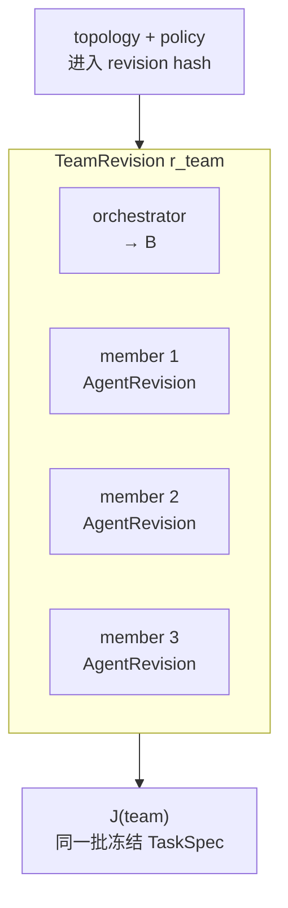
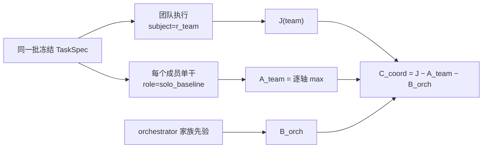
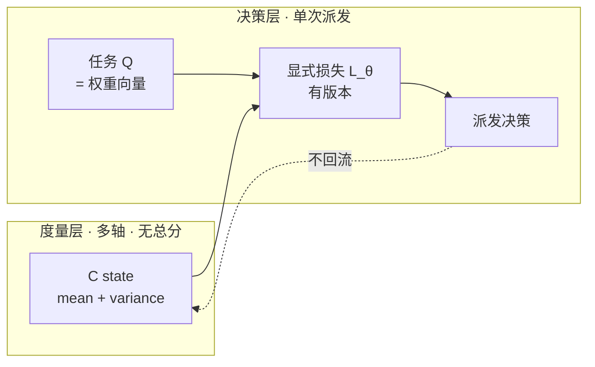

# 多 Agent 协同度量设计 v0.1

状态：`draft / design contract`

本文件定义多 Agent 协同的度量对象、归因合同、锚点和门禁。它不宣称协同增益已被验证；任何协同画像的发布仍要过测量门禁。

## 1. 要回答的问题

单体度量回答「这个 Agent 多强」。协同度量回答一个不同的问题：

> 在固定任务合同下，把这些 Agent 按这个拓扑放在一起，相对**其中最强的成员单干**，多出（或少了）什么？

这个问句决定了整份设计。它不是「团队总分多少」，也不是「谁贡献最大」。

## 2. 为什么不能直接套用七轴

七轴（`livebench-capability-seven/v0.1`）的每一轴都锚在 LiveBench 的公开类目上，这是 \(A\) 存在的前提。**协同能力在 LiveBench 里没有对应类目**，所以在协同维度上 \(C=J-A-B\) 无定义——不是数值缺失，是分解本身不成立。

更具体的问题：现有 J 原子里有三个被隔离在映射 `T` 之外，因为它们接不上任何 LiveBench 子任务：

```text
tool_invocation      工具/消息调用
memory_retrieval     记忆与共享状态读取
context_seeking      主动索取上下文
```

这三个恰好就是协同行为本身。为了保住 \(A\) 锚定的严谨，单体度量把协同信号整个排除了。协同度量必须换一个锚点，才能把它们请回来。

## 3. Team 是一等主体

不引入「团队分数」这种新概念，而是把团队当成一个主体，让现有合同直接复用。

\[
r_{team}=hash(\text{ordered participants},\ \text{topology},\ \text{orchestrator},\ \text{coordination policy})
\]

`TeamRevision` 的不可变标识至少包含：

- 有序参与者列表，每个成员是一个已解析的 `AgentRevision`（model + harness + prompt + tools + env）；
- 拓扑：`sequential` / `hierarchical` / `blackboard` / `debate` / `custom:<hash>`；
- orchestrator 身份与版本（它本身是一个 harness，进 \(B\)）；
- 协同策略：轮次上限、终止条件、共享状态读写权限、冲突裁决规则。

成员集合相同但拓扑不同，是**两个不同的 TeamRevision**。这一点不能松：协同度量的全部意义就在拓扑差异上。



## 4. 锚点：solo baseline，不是公开基准

协同轴的 \(A\) 从**同一批冻结 TaskSpec 上成员单干的结果**取得，不从外部基准取得。

每个成员在同一 `task_spec_id + task_revision` 上以 `role=solo_baseline` 单独执行，把该 J 写成该成员的本地 \(A\)。这条路径复用现有的 `local-probe-same-taskspec/v0.1` 机械件（`src/experience_evaluation/a_local_probe.py`），只新增一个 role。

逐轴取成员上界：

\[
A^{team}_{k}=\max_{i\in members} A^{solo}_{i,k}
\]

取 `max` 而不是均值，是因为要回答的问题是「团队是否打得过它最强的那个成员单干」。这与 \(W_{c,k}=\max_s T_{c,s}\) 的取法一致，都不做行归一化。

于是：

\[
C^{coord}_{r_{team},k}
=J^{team}_{k}
-\max_{i} A^{solo}_{i,k}
-B^{orch}_{k}
\]

三项都在 `canonical_logit/v0.1` 上，独立误差假设下：

\[
SE_{C^{coord}}=\sqrt{SE_J^2+SE_{A^{team}}^2+SE_{B}^2}
\]

其中 \(SE_{A^{team}}\) 取被 `max` 选中的那个成员的标准误，并在元数据里记 `anchor_member_id`——不把 max 的选择当成无成本操作。

**这条锚点比公开 \(A\) 干净。** 团队和 solo baseline 跑的是同一批任务，天然构成 common-item，不存在 README 里承认的那 1.16 logit 任务难度压缩。绝对值在这里是可解释的。



### 负值是结果，不是故障

\(C^{coord}_k<0\) 表示团队在该轴上不如最强成员单干——协同开销超过了协同收益。这是真实且常见的发现。现有纪律（不截断负残差）在这里第一次有了直接的实用价值：它让「多 Agent 反而更差」这个结论可见。

## 5. 协同轴族

协同轴**不进七轴**，是一个独立轴族。七轴锚公开基准，协同轴锚自身单干；两者量尺相同、锚点不同，不能混在同一份合同里。

```text
Axis contract     coordination-capability/v0.1
Scale contract    canonical_logit/v0.1
Anchor contract   solo-baseline-same-taskspec/v0.1
```

| 协同轴 | 含义 | 原子来源 |
|---|---|---|
| `task_decomposition` | 把任务拆成可分派、可验证的子任务 | 新增 |
| `handoff_fidelity` | 交接时信息不丢失、不失真 | `tool_invocation` + 新增 |
| `shared_context_maintenance` | 共享状态的读写正确与一致 | `memory_retrieval` + 新增 |
| `clarification_seeking` | 不确定时主动询问而不是猜 | `context_seeking` |
| `conflict_resolution` | 冲突的编辑或结论如何收敛 | 新增 |
| `redundancy_control` | 不重复劳动、不重复消耗 | 新增 |
| `escalation_judgment` | 知道何时上报、何时停止 | 新增 |

三个原本被隔离的原子在这里重新入场，因为它们不再需要 LiveBench 锚。新增原子必须先进 `config/j_evaluation_atoms.json` 并声明它属于协同族，再进协同映射；**不允许一个原子同时进七轴映射 `T` 和协同映射**，否则同一份证据会被计两次。

## 6. 归因合同

一次协同运行是「一个任务、一个结果、多个贡献者」。归因分三档，默认档最保守。

### 档 1：team-level（默认）

主体是 `r_team`，不声明成员各自贡献了多少。这是 v0 的默认，也是唯一无需额外假设的档。

### 档 2：role-verified

当参与者有**声明角色**且该角色产出**可被客观 verifier 独立检查的产物**时，才做成员级归因。

```text
participant_id + declared_role + artifact_ids → objective verifier → 成员级证据
```

例如「member 2 负责写测试」且测试文件可单独跑。没有可独立验证的产物就不做成员归因，不用启发式（不看 token 数、不看发言轮数、不让 LLM 猜谁贡献大）。

### 档 3：leave-one-out（显式实验）

跑 \(n+1\) 次：完整团队，以及逐个移除一个成员的团队。成员 \(i\) 的边际贡献：

\[
\Delta_{i,k}=J^{team}_{k}-J^{team\setminus i}_{k}
\]

这是唯一有因果解释的档，代价是 \(n+1\) 倍执行成本，且只在该 TaskSpec 批次上成立。必须显式开启，不作为默认。

**不允许的做法**：把团队结果按成员数平均分配；按发言量或 token 占比分配；用 LLM judge 给成员打贡献分再当成证据。这些都是把「无法归因」伪装成「已归因」。

## 7. 交互项

现有数学基础里 \(I_{m,h}=\mathbf 0\)。协同度量把它推广为成员对效应：

\[
\mathbf H_{0,r_{team}}
=\boldsymbol\mu
+\sum_i \mathbf A_{m_i}
+\mathbf B_{orch}
+\sum_{i<j}\mathbf P_{i,j}
+\mathbf U_{r_{team}}
\]

**v0 不估计 \(\mathbf P_{i,j}\)**，理由和 \(I_{m,h}\) 一样：识别它需要交叉设计——同一个成员出现在多个团队里，同一个团队配置跑过多批任务。这正是 B 流水线里 `crossed_task_outcomes` 的思路，可以沿用同一套设计边判定。

在拿到足够交叉数据之前，成员对效应被吸收进 \(C^{coord}\)。因此必须把这一点写在输出里：**\(C^{coord}\) 是拓扑与成员组合的联合残差，不是「协同机制本身」的因果效应。** 换掉一个成员或改一次拓扑就是新的 revision，不能把变化静默吸收进同一条状态。

## 8. 门禁

任一条不满足，协同 C 输出 `unavailable` 加全部原因，不把缺失当 0：

1. 团队与**每个**成员的 solo baseline 跑的是同一 `task_spec_id + task_revision` 集合；
2. 该轴上至少 2 个已观测任务，且带 J 的 bootstrap 或跨任务标准误；
3. 每个成员在该轴都有 `role=solo_baseline` 的 A；缺任一个则输出 `solo_anchor_missing:<member>:<axis>`；
4. solo baseline 的 model + harness revision 与它在团队里出现的 revision 一致；不一致输出 `anchor_revision_mismatch`；
5. orchestrator 能匹配到稳定家族先验或通用 \(B_0\)；
6. `TeamRevision` 哈希完整，拓扑与策略已冻结；
7. 归因档已声明；成员级数值只在档 2 或档 3 下出现；
8. `publication_scope` 取团队运行与所有 solo 运行中**最严格**的那个。

协同轴的 `unknown` / `not_observed` 与数值零严格区分，规则与七轴一致。

## 9. 引擎接口

度量层与决策层分开，这是这份设计里最不能妥协的一条。

**度量层输出**：每个 `(r_team | AgentRevision, axis)` 的后验 `mean` 与 `variance`，来自现有 `CStateStore`。它已经是 Kalman 形式，`variance` 直接可以当 bandit 后验用，探索与利用不需要另建一套。

**决策层输入**：待派发任务的语义掩码 \(Q\) 就是权重向量。同一个 \(Q\) 在测量端决定「哪些轴计入」，在调度端决定「这个任务看重哪些轴」。

**标量化只发生在决策层**，且必须带显式的、有版本的损失函数：

\[
score = L_{\theta}\big(\{(\mu_k,\sigma^2_k)\}_{k},\ Q\big)
\]

这个标量是一次派发决策，**不回流到度量层**，不写进任何画像，不构成排名。规则与现有的展示变换 \(display=F_k(\theta)\) 相同：单向，不回流。



## 10. 不做什么

- 不产生团队总分，不做团队排名；
- 不声称 \(C^{coord}\) 是协同机制的因果效应（除档 3）；
- 不用启发式给成员分配贡献；
- 不把协同轴混进七轴合同；
- 不让同一个原子同时进两个映射；
- 不在缺 solo baseline 时用公开 \(A\) 顶替——那会把任务难度差伪装成协同增益。

## 11. 实现顺序

1. `TeamRevision` 与 `RunBundle` 的团队字段（参与者、拓扑、策略哈希）；
2. `role=solo_baseline` 与逐轴 max 锚点；
3. 协同轴族合同 + 新增原子目录 + 独立映射；
4. 协同 C 生成器与门禁；
5. 交叉设计判定，为 \(\mathbf P_{i,j}\) 铺路；
6. 决策层查询接口（低延迟读，与批处理生成分离）。

第 1 与第 2 步决定数据模型，必须先做；第 6 步是工程形态问题，可以最后补。
